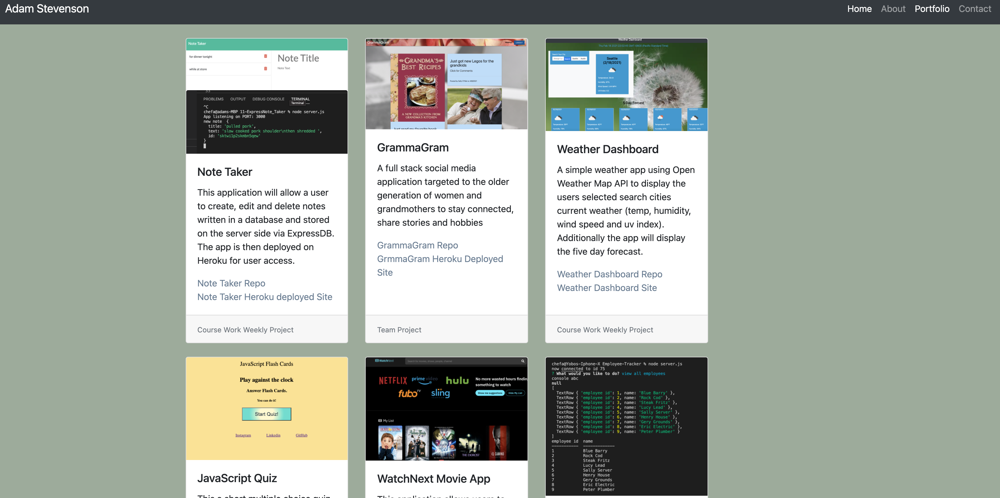
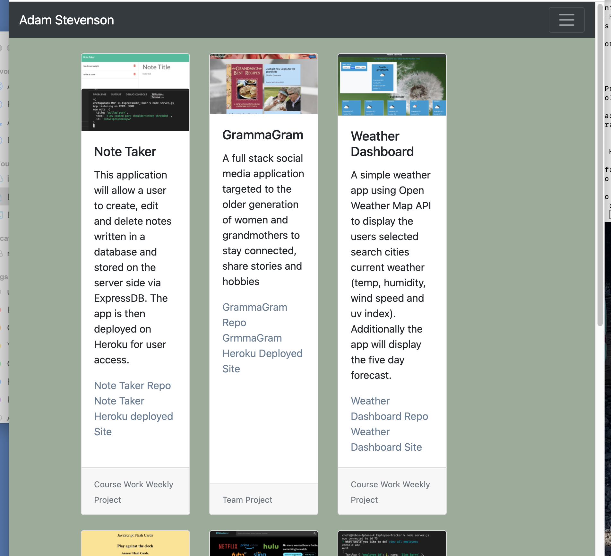
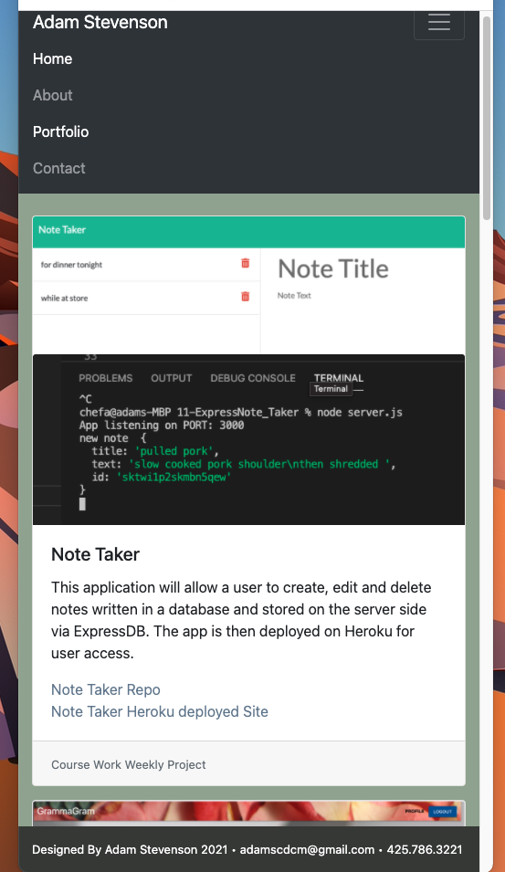

# Portfolio Updated Professional Materials

## Table of Contents
  - [Updated Material and Requirements](#Updated-Material-and-Requirements)
  - [Responsive Screenshots](#Responsive-Screenshots)
  - [Future Development](#Future-Development)
  - [Resume](#Resume)
  - [LinkedIn](#LinkedIn)

This is the 3rd iteration of my Portfolio website. I am adding more projects that reflect some of skills I have learned during the second 3rd of my FSF bootcamp.
Having built a full-stack web application and having more progress to share, this site will demonstrate some of those technoligies and skills. 

## Updated Material and Requirements

* Updated portfolio featuring 6 examples of my work, some deployed as IO on github and some deployed on Heroku.

* Update GitHub profile pinning several examples of my work from deployed projects of homeworks

* Updated resume

* Updated LinkedIn profile

## Responsive Screenshots 

* Full Large Screen

* Meduim Screen

* Mobile Screen

## Future Development

* A live Octopus
* Favorite Things
* Log In Feature
* Tech Blog
* Contact Me Page
* Recipe Files

## Resume 
https://www.dropbox.com/s/0o75rd1pg25t37t/Resume%20Adam%20Stevenson%20Web%20Dev.docx%20%281%29.pdf?dl=0

## LinkedIn
https://www.linkedin.com/in/adam-stevenson-sea/ 

## Questions and Comments
#### email me at:
<adamscdcm@gmail.com> 

## Deployed Portfolio Site
https://adams1971.github.io/Professional_Portfolio/